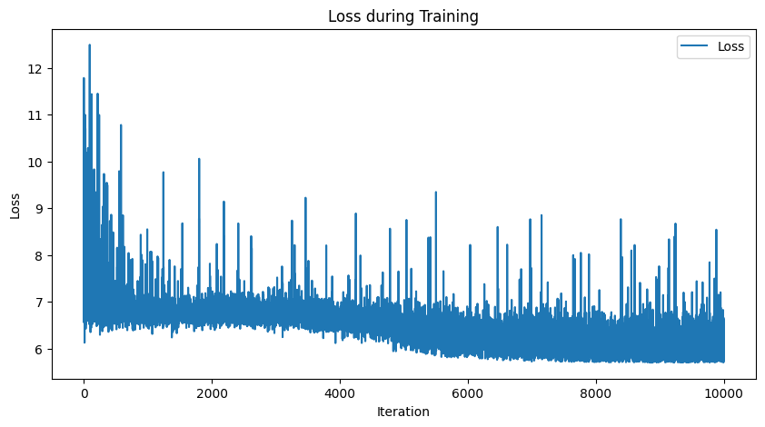
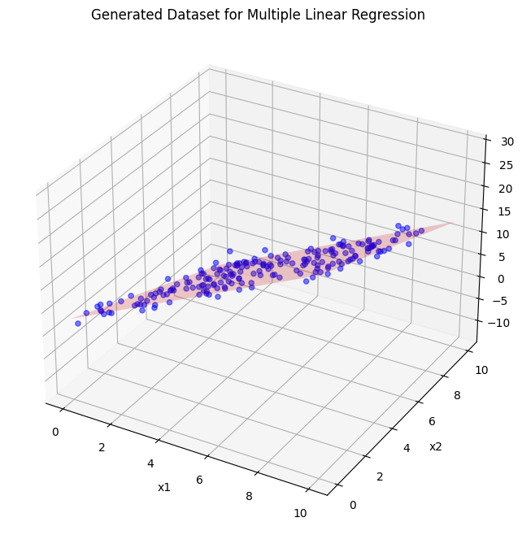

# Bayesian Linear Regression with Pyro

## Introduction

Bayesian Linear Regression extends classical linear regression by treating the model parameters as **random variables** rather than fixed values. This approach allows us to **incorporate uncertainty** into the model’s predictions, providing a **distribution over parameters and predictions**. With Bayesian inference, instead of finding a single set of parameters (as in classical regression), we estimate **posterior distributions** of the parameters based on prior beliefs and observed data.

In this project, we implemented **Bayesian Linear Regression using Pyro** on a **toy dataset**. The feature matrix $\(X\)$ is 2D, and **Normal priors** were placed over the regression parameters, including the weights and bias.

---

## Differences from Classical Linear Regression

1. **Parameter Estimation**:
   - In classical linear regression, the parameters (weights and bias) are estimated using **point estimates** (e.g., Ordinary Least Squares).
   - In Bayesian linear regression, the parameters are **random variables** drawn from **posterior distributions** conditioned on the observed data.

2. **Uncertainty Modeling**:
   - Classical regression provides point predictions with no uncertainty attached to the parameters.
   - Bayesian regression offers a **distribution over predictions**, capturing both model and parameter uncertainty.

3. **Priors**:
   - Bayesian models allow us to incorporate **prior knowledge** by assigning priors (e.g., Normal) to the parameters.
   - This regularization effect is useful in cases of **limited data** or to express prior beliefs.

---

## Model Specification

Given a 2D input feature matrix $X$ and an output vector $y$, the Bayesian Linear Regression model is defined as:

$y = X \cdot w + b + \epsilon$

- **$w$**: Weight vector with a **Normal prior** $\(w \sim \mathcal{N}(0, I)\)$  
- **$b$**: Bias term with a **Normal prior** $\(b \sim \mathcal{N}(0, 1)\)$
-  **$\epsilon$**: Noise term with a Normal prior $\(\epsilon \sim LogNormal(0, 1)\)$
- **$\y\|x$**: likelihood term with a probability ditribution $\(y \sim \mathcal{N}(X \cdot w + b, \epsilon^2)\)$

This model captures uncertainty by placing priors on the weights and bias. After observing data, the posterior distribution is updated to reflect the new information.

---

## Inference using Stochastic Variational Inference (SVI)

In Bayesian models, exact inference is often intractable, especially for high-dimensional problems. Therefore, we use **Stochastic Variational Inference (SVI)**, which approximates the posterior distribution by minimizing the **Kullback-Leibler (KL) divergence** between the true posterior and a variational approximation.

### Key Inference Patterns with SVI

1. **Learning Variational Parameters**:  
   Instead of directly learning the parameters $w$ and $b$, SVI learns the **mean and variance of their variational distributions** (e.g., Normal).

2. **Uncertainty Propagation**:  
   As training progresses, the model learns both the **mean** and **uncertainty** of each parameter. Predictions also reflect this uncertainty by sampling from the learned distributions.

3. **Trade-off between Accuracy and Uncertainty**:  
   In SVI, the optimization involves balancing **data fit** (likelihood) and **model complexity** (prior regularization). As a result, the learned posteriors incorporate both the observed data and prior beliefs.

4. **Convergence Patterns**:  
   During training, the **ELBO (Evidence Lower Bound)** serves as the objective function to be maximized. A **steady increase in ELBO** indicates the model is learning an optimal approximation to the true posterior.

## Training and Loss Behavior

Training a **Bayesian Linear Regression model** involves optimizing the **Evidence Lower Bound (ELBO)** to approximate the posterior distribution of the parameters. Unlike classical linear regression, which aims to minimize a straightforward objective (e.g., Mean Squared Error), Bayesian regression models balance **data fit** and **regularization from the prior distributions**. As a result, the loss function reflects not only how well the model fits the data but also how it adjusts parameter uncertainty.

During training, the **loss function tends to fluctuate more** compared to classical linear regression because:
1. **Posterior Sampling**: At each step, the model samples from variational distributions, adding randomness to the optimization.
2. **KL Divergence Optimization**: The KL term in the ELBO makes optimization more complex, leading to occasional jumps in the loss.
3. **Exploration vs. Exploitation Trade-off**: The model tries to strike a balance between exploring uncertain parameter regions and exploiting regions with better fit to the data.

These fluctuations are natural and expected in **variational inference** processes. As training progresses, the model typically converges, but the path to convergence can exhibit significant **noise** compared to the smooth curve seen in classical regression.

Below is the plot of the **loss function over training epochs**, showing the fluctuations characteristic of Bayesian linear regression:

## Results

In this section, we present the outcomes of our **Bayesian Linear Regression**. The first plot provides a visualization of the **toy dataset** used for training, showing the relationship between the two input features and the target variable. 

### Dataset Plot

Below is the plot of the dataset used in the regression task:

---

### Parameter Estimation

The following table compares the **true parameter values** with the **estimated values** from the Bayesian model. The estimates reflect the **posterior mean** of the parameters, while the **standard deviation** serves as the **uncertainty (confidence interval)** for each parameter.

| Parameter     | True Value | Estimated Value | Standard Deviation (±) |
|---------------|------------|-----------------|------------------------|
| Weight 1 $(\(w_1\))$ |  2.5       | 2.511             | 0.139                    |
| Weight 2 $(\(w_2\))$ |  -1.5       | -1.503             | 0.149                    |
| Bias $(\(b\))$      |  3       | 2.970             | 0.305                    |

---

### Interpretation

- **Posterior Mean**: Represents the most likely value for each parameter based on the observed data and prior knowledge.
- **Standard Deviation**: Provides insight into the **uncertainty** of each parameter, with larger values indicating greater uncertainty.

This table highlights the model's ability to accurately estimate parameters while incorporating **uncertainty quantification** through Bayesian inference.

---

